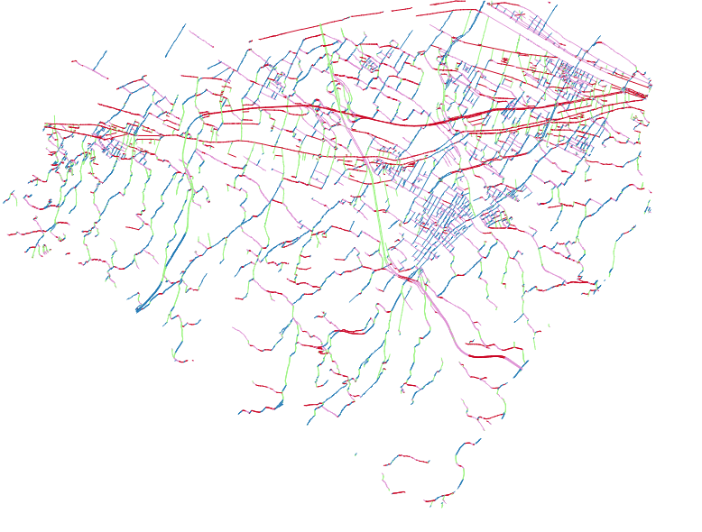

# UNIFI PRIN DATABASE 
## Spatial orientation of road network related to investigated area

## Author

ISTITUTO di BIOMETEOROLOGIA IBIMET-CNR Consiglio Nazionale delle Ricerche

   
### Alfonso Crisci a.crisci@ibimet.cnr.it

### Marco Morabito m.morabito@ibimet.cnr.it

### Giulia Guerri giulia.guerri@stud.unifi.it

This dataset was created to perform investigation inside the  UNIFI PRIN (Progetto di ricerca di rilevante interesse nazionale ) 2015: 

### ADAPTIVE DESIGN e INNOVAZIONI TECNOLOGICHE PER LA RIGERNARAZIONE RESILIENTE DEI DISTRETTI URBANI IN REGIME DI CAMBIAMENTO CLIMATICO

 Prof. Roberto Bologna -  DIDA  Dipartimento di Architetttura Università di Firenze

IN the repository we found the R code to manange streets orientation data obtained by using ShapeOrientation pluginQGIS 

https://plugins.qgis.org/plugins/ShapeOrientation/ 

https://github.com/FFouriauxEveha/ShapeOrientation

This plugin works on road network  calculating the major orientations of a set of lines and draw a rose diagram of these orientations.

For UNIFI PRIN project the database valid for R environment was created by using road network data provided by Regione Toscana SIT.

